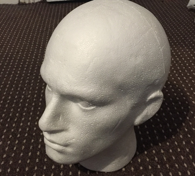
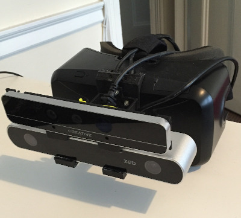
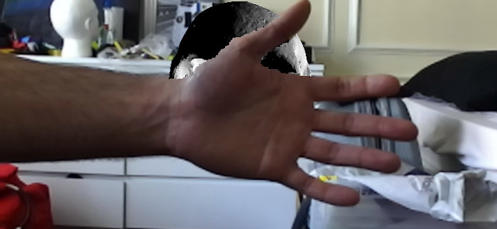
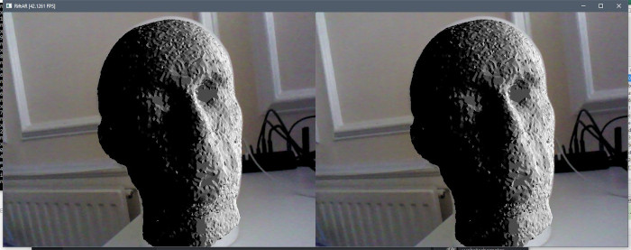

# RiftAR

An implementation of an augmented reality prototype built using a head-mounted display with some cameras attached. The hardware used in the prototype was the Oculus Rift Development Kit 2 as a head-mounted display, a Stereolabs ZED camera to provide stereo vision and an Intel Realsense F200 to measure depth.

## Dependencies.

This project depends on:
* Oculus SDK 1.4
* Latest ZED SDK (with OpenCV bundled inside)
* CUDA 7.5

All other dependencies are packaged in the 3rdparty directory.

## Gallery

_Polystyrene head and the AR prototype, an Oculus Rift DK2 with a ZED Camera and Realsense F200 attached._

_Occlusion of an AR object by a real object using the depth camera._

_A projection of a virtual head over the polystyrene head model._

## TODO
Unfortunately, I ran out of time before handing in my thesis to work on a number of features in the code. As I no longer have access to the prototype, I cannot change any of the code without potentially breaking it. Here are a number of refactors I had in mind:

* Create a `Texture` class inside `Framework` that manages bindings to a texture unit etc, then turn `TextureCV` into a subclass of `Texture`.
* Create a new `Texture` subclass called `TextureCuda` that behaves like `TextureCV` but correctly provides a CUDA surface -> OpenGL texture bridge seamlessly.
* Replace the hard-coded `cv::Mat` -> GL and CUDA -> GL code in `RealsenseCamera` and `ZEDCamera` to use the proposed `TextureCV` and `TextureCuda` classes.

## C++ style notes
Objects that are expected to have a single owner, such as a camera or entity, are stored in a `unique_ptr`. Resources on the other hand such as Models and Shaders that can be shared between many entities are stored in a `shared_ptr`.
